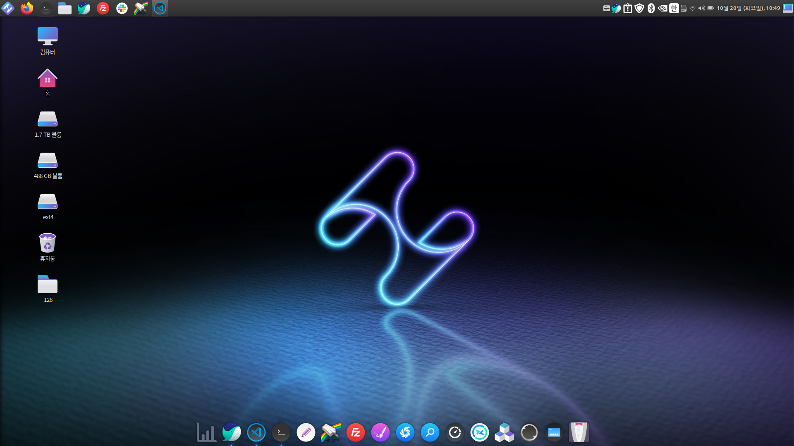

## hamonikr-meta

하모니카 4.0 데스크톱 환경을 설치하는 메타 패키지입니다.
이 프로그램은 HamoniKR 4.0 데스크탑 기본 환경을 모두 설치하게 됩니다.

 * Package: hamonikr-meta-cinnamon
 * Package: hamonikr-desktop-environment

## Screen shot


## Usage

하모니카 데스크톱 환경을 설치하는 방법은 다음과 같습니다.

먼저 하모니카 저장소를 추가해야 합니다.
다음의 명령을 터미널에서 실행해서 하모니카 저장소를 추가해주세요.

```
curl -sL https://pkg.hamonikr.org/add-hamonikr-jin.apt | sudo -E bash -
 
또는
 
wget -qO- https://pkg.hamonikr.org/add-hamonikr-jin.apt | sudo -E bash 
```

저장소가 추가되었으면 이제 하모니카 OS의 기본정보를 가지고 있는 파일을 설치합니다.
```
sudo apt install -y hamonikr-system-settings
```

이제 하모니카 데스크톱 환경을 설치합니다.
다음의 명령어를 터미널에 입력하세요.
```

sudo apt install hamonikr-desktop-environment
``` 

## LICENSE
[LICENSE](./LICENSE)

## Issue

https://github.com/hamonikr/hamonikr-meta
