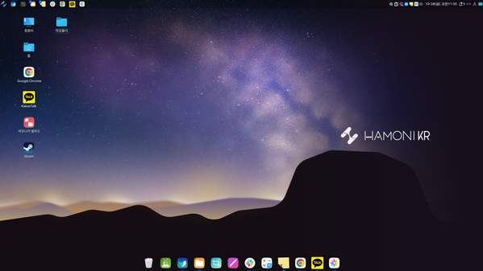

## ubuntu-hamonikr-respin

우분투를 사용하고 있어도 하모니카 OS의 향상된 UX 및 프로그램을 사용할 수 있습니다.




 - 우분투 데스크톱을 하모니카로 변경하는 패키지 : `ubuntu-hamonikr-respin`

### Ubuntu 22.04 에서 하모니카 데스크톱 환경을 사용하는법

```
wget -qO- https://repo.hamonikr.org/hamonikr.apt | sudo -E bash -

sudo apt-get install -y ubuntu-hamonikr-respin

```

### Ubuntu (20.04), LMDE 5, Debian (bullseye) 에서 하모니카 데스크톱 환경을 사용하는법

우분투 및 데비안 계열에서 다음과 같이 하모니카 환경을 사용할 수 있습니다.

```
wget -qO- https://update.hamonikr.org/add-update-repo.apt | sudo -E bash -

sudo apt-get install hamonikr-desktop-environment

```

## hamonikr-meta 패키지 설명

하모니카OS 데스크톱 환경을 구성하는 메타 패키지로 아래와 같이 제공됩니다.
 - 우분투 데스크톱을 하모니카로 변경하는 패키지 : `ubuntu-hamonikr-respin`
 - 하모니카OS 기본 환경을 구성하는 패키지 : `hamonikr-desktop-minimal`
 - 하모니카OS 전체 기능을 포함한 패키지 : `hamonikr-desktop-environment`
 - 하모니카OS 개발팀에서 제공하는 고급 사용자를 위한 패키지 : `hamonikr-desktop-full`
    ```
    asbru-cm, boot-select, convert-svg, mainline, hamonikr-ff, hamonikr-checksum, live-usb-creator, systemback, qt-fsarchiver
    ```
 - 하모니카OS 환경에서 소프트웨어를 개발하는 개발자를 위한 추가 패키지 : `hamonikr-desktop-extra`
    ```
    hamonikr-cli-tools, filezilla, slack-desktop, zoom, gimp, inkscape, gh, github-desktop 등
    ```    

